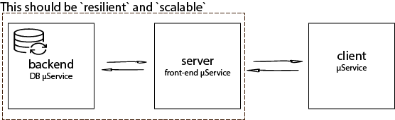

# dev-ops-exercise

[](https://circleci.com/gh/pedroguima/exercise-dev-ops/tree/develop)




## Building and packaging

   The sources are compiled (``ci/build.sh``) and included in a minimal container during the build stage (``circleci/config.yml``). The new container images are then pushed to docker hub: [tcbackend](https://hub.docker.com/r/pedroguima/tcbackend/) and [tcserver](https://hub.docker.com/r/pedroguima/tcserver).


## Deployment

   These services are deployed to __Google Cloud Platform__ under __Kubernetes__ (Google Container Engine).

   2 replicas are deployed with 2 containers per pod.

   To increase the number of replicas update the file (``ci/k8s.yml``), commit and run:
   
   ``kubectl apply -f ci/k8s.yml``
    


## Automation

  All the automation is done by CircleCI. Please check ``.circleci/`` for further information.


## To do

  - Use `scratch` image instead of ``debian`` as that would be more efficient (would need to fix the static libraries reference problem);
  - Don't build if only non-relevant files are updated;
  - Should ``client`` also be a containerized microservice? If so, adding it should be trivial.


## Testing the remote application: 

The backend and the server are deployed on GCloud at ```tcexercise.thisispedro.com:8888```.

    1> cd client
    1> go run client.go

In this terminal you should receive a list of responses from the `server`.

In the server terminal a response from the backend (check container logs).

In the backend a list of saved data (check container logs).


##  General Guidelines

       Can you run your implementation multiple times without any problem?
Yes.


       What happens if a service crashes?
k8s will rollout other pod to replace it.

       How would a new Version be deployed to replace the previous one?
       
Do the changes, commit, PR to ```develop``` branch, merge and wait for [CircleCI](https://circleci.com/gh/pedroguima/exercise-dev-ops) to finish the pipeline.
       
       How would you organized a rollback?

``kubectl rollout history deployment/tcexercise-deployment``
``kubectl rollout undo deployment/tcexercise-deployment`` or ``kubectl set image deployment/tcexercise-deployment $SERVICE=$DOCKER_REPO/$DOCKER_USER/$SERVICE:"PROPER_VERSION```


       How much effort will it take to create a new service? D.R.Y!

This will depend on the service. Questions would need to be asked.

